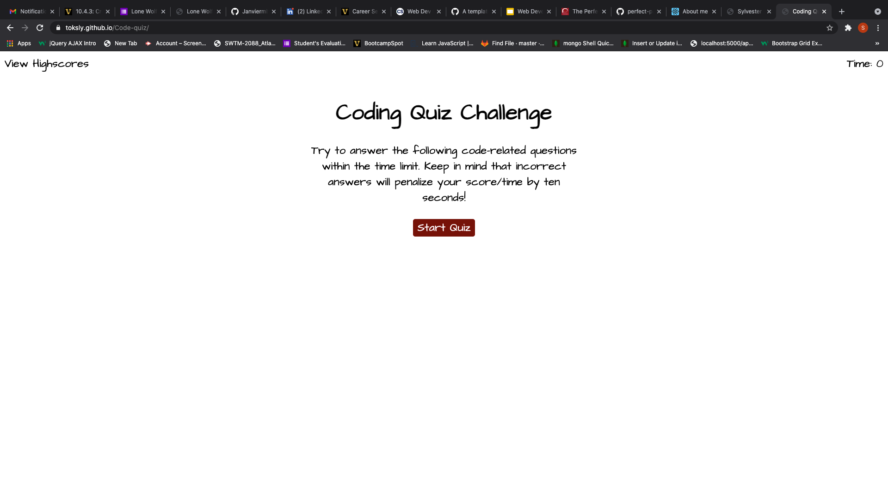

# Code-quiz

## Description

This application provides students a platform to use for taking timed quiz. It contains stored multiple choice questions and answers from which the user will be able to choose an answer from by clicking a button.This application also records high scores.

## Table of Contents

- [Website](#website)
- [Built with](#built-with)
- [Usage](#usage)
- [Contributors](#contributors)

---

## Website

https://toksly.github.io/Code-quiz/

---

## Built with

- Javascript
- CSS
- HTML

[Back to Table of Contents](#table-of-contents)

---

## Usage

To use this appication, simply click the start button to start the quiz. Once the quiz is started, time is authmatically substracted from the initial time.

[Back to Table of contrents](#table-of-contents)

---

## Contributors

---
---

Sylvester Nwizu

---
---

[Back to Table of Contents](#table-of-contents)

